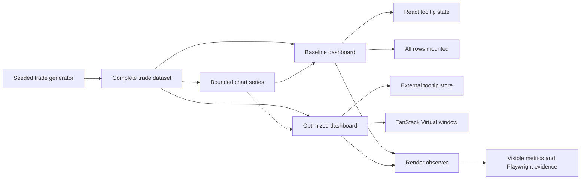

# Frontend Performance Lab

An instrumented React case study that renders 100,000 deterministic synthetic trades while keeping high-frequency tooltip updates outside the dashboard render path.

[](https://github.com/rinatgumarov/frontend-performance-lab/actions/workflows/ci.yml)

## What this proves

- A 100,000-row dataset does not require 100,000 mounted DOM rows. The optimized table renders only the visible window plus overscan.
- High-frequency chart state can be isolated without moving the whole interface outside React. Only the tooltip subscribes to its external store.
- Performance claims can be expressed as reproducible structural invariants instead of machine-specific timing promises.
- A deliberately simple baseline makes the cost of each optimization visible and interview-defensible.

The default view starts in the optimized 10K case so a portfolio visit stays lightweight. The full 100K scenario remains one explicit control away. Baseline mode is intentionally capped at 10K rows so the comparison remains inspectable without making the browser tab unsafe.

## Live demo

- [Application](https://rinatgumarov.github.io/frontend-performance-lab/)
- [Storybook](https://rinatgumarov.github.io/frontend-performance-lab/storybook/)
- [npm package](https://www.npmjs.com/package/@riguran/render-observer)
- [Source repository](https://github.com/RinatGumarov/frontend-performance-lab)

The application and Storybook are assembled into one GitHub Pages artifact. Package releases use the same source tree and a separately verified package boundary.

## Measured comparison

The checked-in benchmark drives the same 10K dataset through 30 distinct chart-pointer positions in Chromium at 1440 × 900.

| Mode | Dashboard render delta | Tooltip render delta | Mounted trade rows |
| --- | ---: | ---: | ---: |
| Baseline | 30 | 0 | 10,000 |
| Optimized | 0 | 30 | 22 |

The optimized 100K case is also required to mount no more than 80 trade rows at the benchmark viewport. See the generated [benchmark evidence](artifacts/performance/latest.md) and [raw observation](artifacts/performance/raw.json). Observed durations are retained as context, never used as portable pass/fail thresholds.

## Architecture



Both modes share the generator, chart adapter, tooltip, trade row, formatting, styling, and observer. The comparison changes only two boundaries: where tooltip state lives and how trade rows are mounted.

Inter and IBM Plex Sans are served as fingerprinted local WOFF2 assets. The table keeps the complete selected dataset, while the chart receives a chronological min/max sample capped at 2,000 points with source trade metadata preserved for accurate tooltips.

The implementation decisions are recorded in:

- [ADR-001: Comparison contract](docs/adr/001-comparison-contract.md)
- [ADR-002: Tooltip state boundary](docs/adr/002-tooltip-state-boundary.md)
- [ADR-003: Table virtualization](docs/adr/003-table-virtualization.md)
- [ADR-004: Package boundary](docs/adr/004-package-boundary.md)
- [ADR-005: Safe startup and bounded chart data](docs/adr/005-safe-startup-and-bounded-chart-data.md)

## Storybook and npm package

Storybook uses production components and CSS rather than parallel demo implementations. Its component states cover tooltip outcomes, profitable and losing trades, empty and populated metrics, both dashboard strategies, the optimized application, and the capped baseline. Interaction tests run in real Chromium with accessibility checks. The deliberately pathological 10K baseline application story skips its duplicate axe pass; the equivalent 48-row baseline composition remains accessibility-checked.

`@riguran/render-observer` is a small ESM package with a framework-free core and an optional React subpath. The release tarball is checked from a clean consumer project: exported JavaScript, declarations, runtime imports, peer dependencies, package contents, and every TypeScript example in the package README must resolve before publication.

Pushes do not publish the npm package. The first release is a manual protected-environment workflow, separate from the CI-gated Pages deployment.

## Run locally

Requirements: Node.js 24 and pnpm 10.

```bash
corepack enable
pnpm install --frozen-lockfile
pnpm dev
```

The Vite development server prints the local URL. To inspect components independently:

```bash
pnpm storybook
```

## Run the benchmark

Install the pinned Playwright Chromium build once, then run the structural comparison:

```bash
pnpm --filter @riguran/frontend-performance-lab exec playwright install chromium
pnpm benchmark
```

The command builds the workspace, opens the production preview at 1440 × 900, performs the pointer sequence, validates the invariants, and rewrites `artifacts/performance/raw.json`, `latest.json`, and `latest.md`.

## Testing

```bash
pnpm verify:local       # lint, types, unit tests, script tests, production builds
pnpm test:storybook     # component interactions and accessibility in Chromium
pnpm test:e2e           # Chromium flows plus a WebKit startup smoke test
pnpm pack:check         # tarball contents and clean-consumer imports/types
pnpm build:storybook    # static Storybook output
```

The browser benchmark is intentionally structural. CI does not fail because one runner records a slower duration than another.

## Trade-offs

- The baseline cap means the project compares tooltip behavior at 10K, while the optimized-only row ceiling is demonstrated at 100K.
- DOM windowing preserves semantic row markup and familiar React composition, but searching the full dataset requires application-level controls rather than browser text search.
- The equity chart uses at most 2,000 chronologically ordered points, preserving endpoints and per-bucket minima and maxima. The virtual table still exposes all selected trades.
- Render markers are portable structural evidence. React Profiler durations are available only in React builds with profiling enabled and remain observational.
- Deterministic fixtures improve repeatability but do not model a live feed, network backpressure, or server-side pagination.

## Privacy and provenance

All trades, prices, timestamps, and benchmark artifacts are generated locally from deterministic fixtures. The repository contains no proprietary datasets, internal employer material, or TradingView code or data. The visual system and implementation were created specifically for this public case study.

Licensed under the MIT License.
